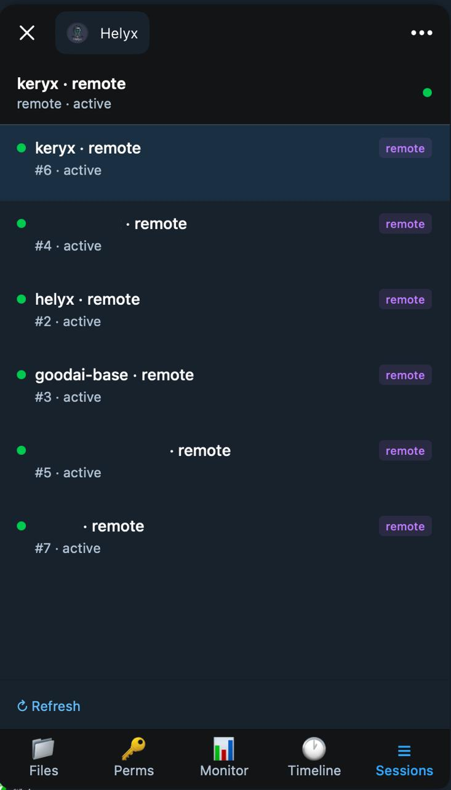
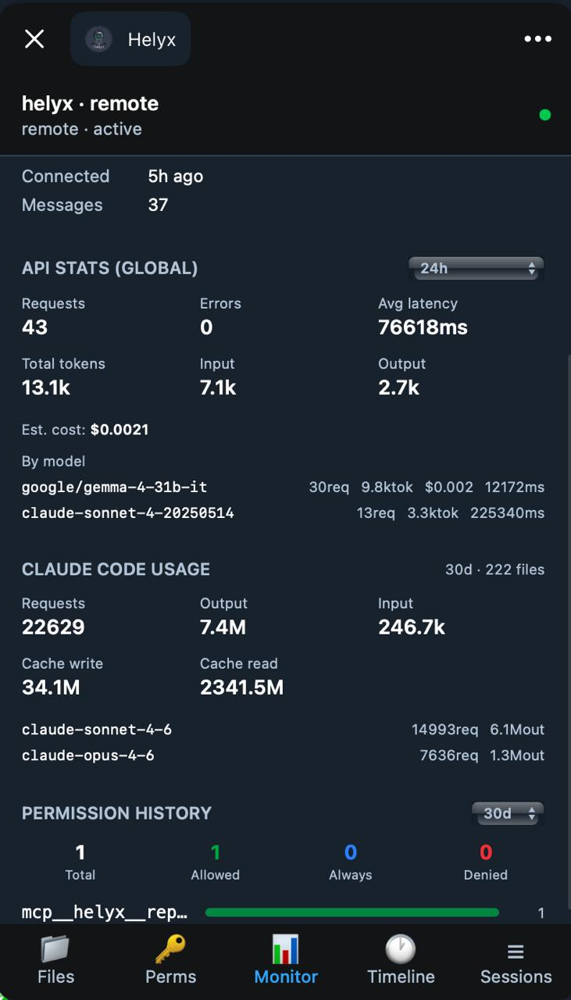

# Helyx Dashboard — Telegram Mini App

A mobile-first Telegram Mini App for monitoring Claude Code sessions, viewing API stats, and managing permissions — directly from your phone.

## Opening the App

The app opens via the **Open App** button on the @helyx_grace_bot profile (or any chat with the bot). It authenticates automatically using your Telegram identity — no login required.

## Screens

### Sessions Tab
Lists all active and recent Claude Code sessions. Each session shows:
- Session name (project or repo name)
- Source type (`remote` / `local`)
- Status dot: green = active, gray = idle

Tap a session to open it and switch between tabs (Files, Perms, Monitor, Timeline).



### Monitor Tab
Real-time stats for the selected session:

- **Connection info** — how long ago it connected, message count
- **API Stats (Global)** — requests, errors, average latency, token usage, estimated cost, breakdown by model
- **Claude Code Usage** — total requests/tokens over 30 days, cache write/read, per-model breakdown
- **Permission History** — total, allowed, always-allowed, denied counts



### Files Tab
Browse the git repository of the selected session:
- **Files** — tree view with fuzzy filter, tap to view file contents
- **Log** — commit history with diff viewer
- **Status** — modified/staged/untracked files with per-file diffs

### Perms Tab
Approve or deny pending tool permission requests from Claude:
- **Allow** — one-time approval
- **Deny** — reject this request
- **Always** ♾️ — add to `settings.local.json` so it's never asked again

Auto-polls every 3 seconds while open.

### Timeline Tab
Chronological activity feed for the session.

## Setup (BotFather)

To show the **Open App** button on the bot profile:

1. Open [@BotFather](https://t.me/BotFather)
2. Send `/setmenubutton`
3. Choose `@helyx_grace_bot`
4. Select **Web App**
5. Enter URL: `https://helyx.mrciphersmith.com`
6. Enter button label: `Open App`

To fix "Bot domain invalid" on the Login Widget:

1. Send `/setdomain` to BotFather
2. Choose `@helyx_grace_bot`
3. Enter: `helyx.mrciphersmith.com`

## Development

```bash
cd dashboard
bun install
bun run dev      # starts at localhost:5173
bun run build    # production build → dist/
```

The dev server proxies `/api` to `localhost:3847` (the bot's HTTP API server).

Auth is skipped in dev mode when no `Telegram.WebApp.initData` is present.

## Tech Stack

- React + TypeScript + Vite
- Tailwind CSS with Telegram CSS variables (`--tg-theme-*`)
- Telegram WebApp JS SDK for auth and theming
- JWT cookie auth (HMAC-verified `initData`)
