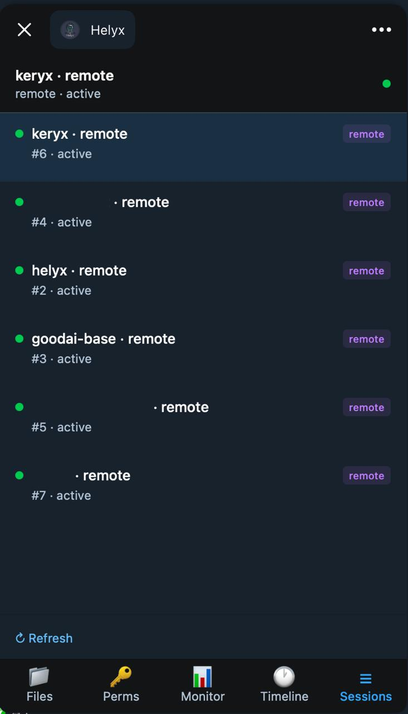
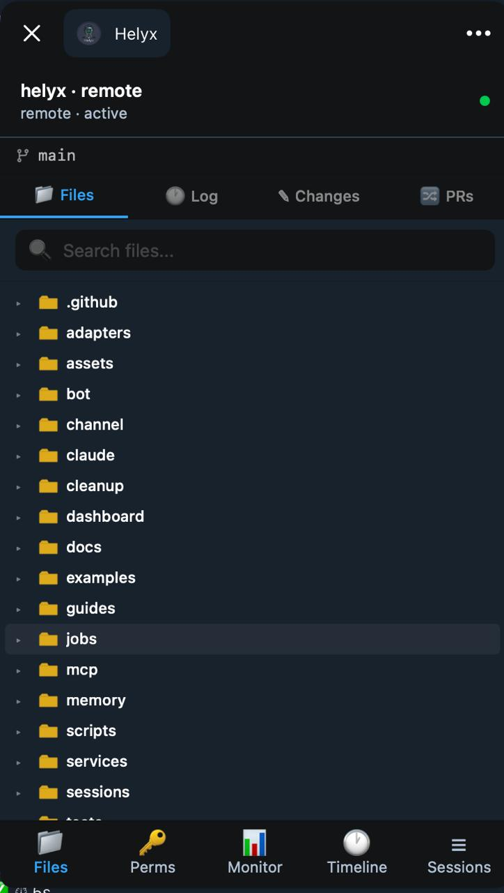
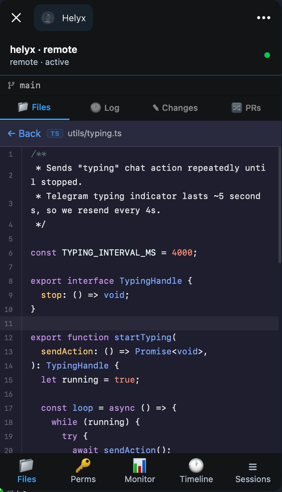
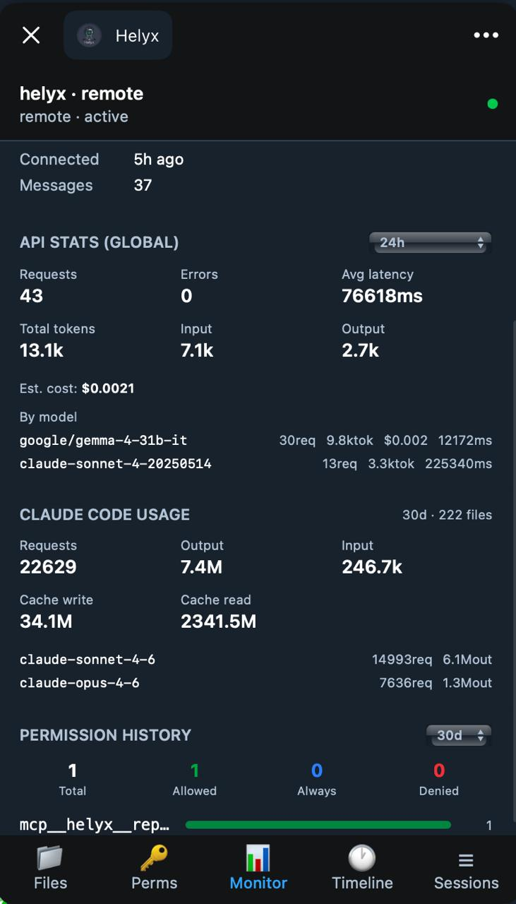

# Telegram Mini App — Claude Dev Hub

The Claude Dev Hub is a mobile-first WebApp embedded in the bot, accessible via the **Dev Hub** button in Telegram's menu.

---

## Opening the App

1. Open your bot chat in Telegram
2. Tap the **Dev Hub** button in the menu bar (bottom of chat)
3. The app opens as a Telegram WebApp — auto-themed to your Telegram light/dark mode

---

## Git Browser (📁)

Browse your project's git repository directly from mobile.

**File Tree:**
- Hierarchical tree with collapsible folders (dirs first, then files alphabetically)
- File icons by extension (TypeScript, JavaScript, JSON, Markdown, Python, Go, Rust, and more)
- Current branch shown in header (⎇ branch-name)
- Live search/filter — matches anywhere in the path, auto-expands matching folders

**File Viewer:**
- Syntax highlighting via `highlight.js` (12 languages)
- Line numbers, dark theme
- Click any file in the tree to view its content

**Commit Log:**
- `git log` with author, relative date, short hash
- Click any commit to view its full diff

**Working Tree Status:**
- `git status` with status badges: `M` (modified), `A` (added), `D` (deleted), `R` (renamed)
- Click any file to view its diff vs HEAD

**Diff View:**
- Color-coded unified diff: green additions / red removals / blue hunk headers

> **Note:** The git browser reads committed and working tree state directly from the host filesystem via a Docker volume mount (`${HOME}:/host-home:ro`). It does not connect to GitHub.

---

## Permission Manager (🔑)

Review and respond to Claude's permission requests from mobile — no need to be at the terminal.

- Real-time list of pending permission requests (auto-polls every 3 seconds)
- **✅ Allow** — approve this specific request
- **❌ Deny** — deny this specific request
- **♾️ Always Allow** — approve and write a pattern to `settings.local.json` so future similar requests are auto-approved

The "Always Allow" button adds a pattern like `Edit(*)` or `Bash(git *)` to your local settings, which takes effect immediately for all future sessions.

---

## Session Monitor (📊)

Live overview of all sessions.

**Status indicators:**
- 🟢 **Working** (pulsing) — Claude is actively processing
- ⚪ **Idle** — session connected but no recent activity
- 🔴 **Inactive** — session disconnected

**Session info:**
- Project name, path, source (`remote` / `local`), status
- Connected time, message count

**API Stats (global):**
- Requests / Errors (highlighted red if > 0) / Avg latency
- Total / Input / Output tokens
- Estimated cost
- Per-model breakdown: requests · tokens · cost · avg latency
- Time window selector: **24h** / **Since restart** / **All time**

**Permission History:**
- Summary counts: Total / Allowed / Always Allowed / Denied / Pending
- Bar chart of top 8 tools by usage with allow-rate progress bar
- Shares the same time window selector as API Stats

**Tool Calls:**
- Last 15 tool calls with status dot (🟢 allow / 🔴 deny / 🟡 pending) and relative time

**Session Sidebar:**
- All sessions listed with source badge and status dot
- **Switch** button — switches the bot's active session for your Telegram chat
- **Delete** button — visible only for `source=local` non-active sessions; deletes all session data

---

## Session Timeline (🕐)

Chronological view of all messages and memory events interleaved in one list.

**Filter bar:**
- **All** — messages and memory events together
- **Messages** — only chat messages (user/assistant/system)
- **Memories** — only memory save events

**Message bubbles:**
- User messages — right-aligned blue bubble
- Assistant messages — left-aligned gray bubble
- System messages — centered small gray text

**Memory events:**
- Compact purple block: `🧠 type` (fact/summary/decision/note/project) + content preview + timestamp
- Tap to expand full content

**Pagination:** "Load older" button at top — loads 100 earlier items, does not disrupt auto-refresh  
**Auto-refresh:** every 5s, but only when viewing the latest page (pauses if you've navigated to older items)

**Export:** Use `/session_export [id]` in Telegram to download the full session as a `.md` transcript file.

---

## Authentication

The app uses Telegram's built-in auth:

1. Telegram passes `initData` to the WebApp on launch
2. The bot verifies the HMAC-SHA256 signature server-side
3. A JWT is returned in the response body
4. All subsequent API requests use `Authorization: Bearer <jwt>`

> Telegram WebView does not reliably persist cookies, so JWT is stored in memory and passed as a header.

---

## Whether the Mini App is actually there

Two env flags have to agree, and nothing enforced that before v1.55.0. `ENABLE_DASHBOARD` is a runtime flag; `WITH_DASHBOARD` is a **build** argument that defaults to `false`, because the dashboard build stages take the image from ~256 MB to ~1 GB. A bot started with `ENABLE_DASHBOARD=true` but built with `WITH_DASHBOARD=false` (the default) used to show a plain `Not Found` in the Mini App — the route was fine, the files just were not in the image, and nothing said so.

`utils/dashboard-readiness.ts` now checks both facts (`ENABLE_DASHBOARD` and whether `dashboard/webapp/dist` actually has files in it) together:

- If the dashboard is disabled, this is silent — correct, and not worth a warning on every small deployment.
- If it is enabled but `dashboard/webapp/dist` (or `dashboard/dist`) is empty, `GET /webapp/*` answers with **503** and a message naming both the missing flag and the fix: set `WITH_DASHBOARD=true` in `.env` and `docker compose up -d --build bot`. The same check runs once at startup and logs the same message at error level, so the mismatch shows up in `docker logs` even before anyone opens the Mini App.
- The Telegram **Dev Hub** menu button itself is suppressed when the Mini App was not built — a button that opens `Not Found` is worse than no button, since the operator presses it more than once. If you enabled the dashboard but never see the Dev Hub button, this is why; check the bot's startup log for the `[dashboard]` line.

An install that answers "yes" to the dashboard prompt now writes both `ENABLE_DASHBOARD` and `WITH_DASHBOARD` to `.env` together — previously only `ENABLE_DASHBOARD` was written, which is exactly the mismatch above.

---

## Infrastructure

- Built as a separate Vite + React app in `dashboard/webapp/`
- Built to `dashboard/webapp/dist/`, served at `/webapp/`
- `/telegram/webapp/*` redirects to `/webapp/*` for BotFather URL compatibility
- `webapp-build` Dockerfile stage runs in parallel with the main dashboard build
- `git` is installed in the production Docker image for git API support

Full technical specification: [`dashboard/webapp/SPEC.md`](../dashboard/webapp/SPEC.md)
